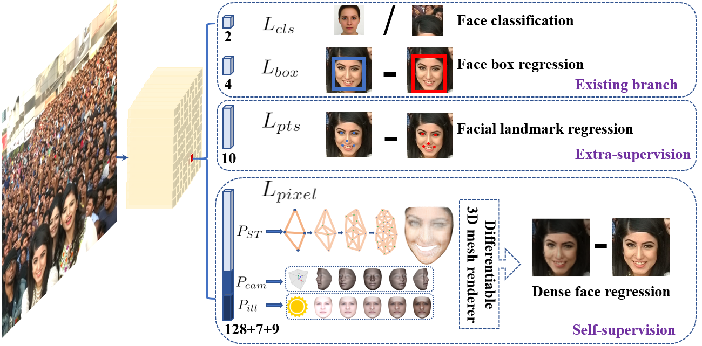

# Retina Face 

[RetinaFace](https://github.com/deepinsight/insightface/tree/master/detection/retinaface) 
is a practical single-stage SOTA face detector which is initially introduced in [arXiv](https://arxiv.org/abs/1905.00641) (2019) 
and [IEEE](https://ieeexplore.ieee.org/document/9157330) (2020). 

## Data 
__WIDER Face Dataset__ consists of *32303* images, *393703* face bounding boxes with a high degree of variability in scale, pose, expression, occlusion and illumination.

Data is additionally annotated 5 facial landmarks (eye centers, nose tip and mouth corners).

Data is divided into 5 levels (according to how difficult it is to annotate landmarks on the face)

  
 5 Levels Face Data Description 

  

  
  |  Level  |  Face Number |  Criterion | 
  |---|---|---|
  |  1 (easiest)  |  4127  |  Easy to determine 68 landmarks  |
  |  2   |  12636  |  Can determine 68 landmarks  |
  |  3  |  38140  |  Easy to determine 5 landmarks  |
  |  4  |  50024  |  Can determine 5 landmarks  |
  |  5 (hardest)  |  94095  |  Determine by contexts  |
  
  

In total, we have annotated 84.6k faces on the training set and 18.5k faces onthe validation set   
(According to the paper, ratio of `train:val:test` is `40:10:50`, the exact ratio is a question)

## Multi-task Loss
The loss functions include:
* Face Classification Loss
* Box Regression Loss
* Facial Landmark Loss
* Dense Regression Loss

$$
L = L_{cls} (p_i, p^*_i) + λ_1 p^*_i L_{box}(t_i, t^*_i) + λ_2 p^*_i L_{pts}(l_i, l^*_i) + λ_3 p^*_i L_{pixel}
$$

With anchor $ i $ and ground truth box $ i^* $, we have
1. Face Classification Loss $ L_{cls} (p_i, p^*_i) $, where $ p_i $ is the predicted probability of anchor $ i $ being a face and $ p^*_i $ is 1 for the positive anchor and 0 for the negative anchor. The classification loss $ L_{cls} $ is the softmax loss for binary classes (face/not face)
2. Face box regression loss $ L_{box}(t_i, t^*_i) = smoothL1 (t_i, t^*_i) $,
where $ t_i = \{t_x, t_y, t_w, t_h \} $ and $ t^*_i = \{t^*_x, t^*_y, t^*_w, t^*_h \} $ represent the coordinates of the predicted box and ground-truth
box associated with the positive anchor.
3. Facial landmark regression loss $ L_{pts}(l_i, l^*_i) = smoothL1 (l_i, l^*_i) $, where $ l_i = \{ l_{x1}, l_{y1}, ..., l_{x5}, l_{y5}\} $ and $ l^*_i = \{ l^*_{x1}, l^*_{y1}, ..., l^*_{x5}, l^*_{y5}\} $ represent the predicted five facial landmarks and groundtruth associated with the positive anchor
4. Dense regression loss $ L_{pixel} $: TODO